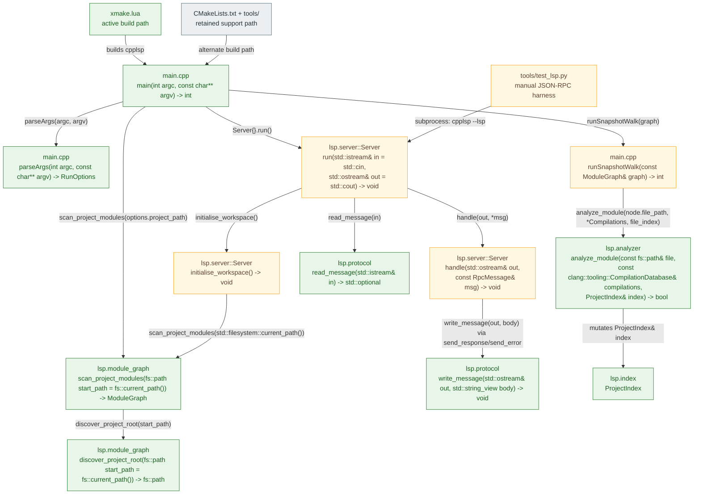

# Current LSP Codebase State

This is the current implementation state of the LSP-related code, not the fuller target architecture described in [`docs/design.md`](/Users/mihira/c/cpplsp/docs/design.md).

- Green: implemented and actively used
- Amber: implemented but only partially wired or still stubbed
- Gray: support or legacy tooling

## LSP Module Call Paths

Arrows below represent direct calls that exist in the current code.

## Analyzer and Index Interaction

This diagram expands the current `lsp.analyzer` and `lsp.index` implementation. Every arrow is a direct method or function call in the code.

```mermaid
flowchart TD
    analyze_module["analyze_module(\n  const fs::path& file,\n  const clang::tooling::CompilationDatabase& compilations,\n  ProjectIndex& index\n) -> bool"]
    read_module_name["read_module_name(const fs::path& file_path) -> std::string"]
    factory_ctor["IndexingActionFactory(\n  const fs::path& project_root,\n  const fs::path& analyzed_file,\n  const std::string& module_name,\n  ProjectIndex& index\n)"]
    tool_run["clang::tooling::ClangTool::run(FrontendActionFactory*) -> int"]
    factory_create["IndexingActionFactory::create() -> std::unique_ptr<clang::FrontendAction>"]
    action_create["IndexingAction::CreateASTConsumer(\n  clang::CompilerInstance& compiler,\n  llvm::StringRef\n) -> std::unique_ptr<clang::ASTConsumer>"]
    handle_tu["IndexingConsumer::HandleTranslationUnit(clang::ASTContext& context) -> void"]
    traverse["IndexingVisitor::TraverseDecl(context.getTranslationUnitDecl()) -> bool"]

    visit_record["VisitCXXRecordDecl(clang::CXXRecordDecl*) -> bool"]
    visit_enum["VisitEnumDecl(clang::EnumDecl*) -> bool"]
    visit_method["VisitCXXMethodDecl(clang::CXXMethodDecl*) -> bool"]
    visit_fn["VisitFunctionDecl(clang::FunctionDecl*) -> bool"]
    visit_var["VisitVarDecl(clang::VarDecl*) -> bool"]
    visit_alias["VisitTypeAliasDecl(clang::TypeAliasDecl*) -> bool"]
    visit_concept["VisitConceptDecl(clang::ConceptDecl*) -> bool"]
    visit_class_tpl["VisitClassTemplateDecl(clang::ClassTemplateDecl*) -> bool"]
    visit_fn_tpl["VisitFunctionTemplateDecl(clang::FunctionTemplateDecl*) -> bool"]
    visit_var_tpl["VisitVarTemplateDecl(clang::VarTemplateDecl*) -> bool"]
    visit_alias_tpl["VisitTypeAliasTemplateDecl(clang::TypeAliasTemplateDecl*) -> bool"]
    visit_using["VisitUsingDecl(clang::UsingDecl*) -> bool"]
    visit_ns_alias["VisitNamespaceAliasDecl(clang::NamespaceAliasDecl*) -> bool"]

    record_named["record_named_decl(\n  SymbolKind kind,\n  const clang::NamedDecl* declaration,\n  clang::SourceLocation location,\n  const std::string& signature = {},\n  const std::string& return_type = {}\n) -> void"]
    record_fn["record_function_decl(\n  SymbolKind kind,\n  const clang::FunctionDecl* declaration,\n  clang::SourceLocation location\n) -> void"]
    make_record["make_symbol_record(\n  SymbolKind kind,\n  const clang::NamedDecl* declaration,\n  clang::SourceLocation location\n) -> std::optional<SymbolRecord>"]
    build_params["build_params(const clang::FunctionDecl* function) -> std::vector<ParamInfo>"]
    build_sig["build_function_signature(\n  const clang::FunctionDecl* function,\n  std::string_view display_name,\n  const std::vector<ParamInfo>& params\n) -> std::string"]

    add_symbol["ProjectIndex::add_symbol(SymbolRecord symbol) -> void"]
    normalize_short["normalize_search_text(std::string_view text) -> std::string"]
    normalize_mod["normalize_module_name(std::string_view text) -> std::string"]
    normalize_file["normalize_file_key(const std::filesystem::path& path) -> std::string"]
    trigrams["collect_trigrams(std::string_view text) -> std::vector<std::string>"]

    search_symbols["ProjectIndex::search_symbols(\n  std::string_view query,\n  std::size_t limit = 20\n) -> std::vector<const SymbolRecord*>"]
    lookup_ids["lookup_ids(const Map& index, const std::string& key) -> std::vector<SymbolId>"]
    top_ranked["take_top_ranked(\n  const std::vector<SymbolId>& candidate_ids,\n  std::string_view normalized_query,\n  std::size_t limit\n) -> std::vector<const SymbolRecord*>"]
    rank_symbol["rank_symbol(\n  std::string_view normalized_query,\n  const SymbolRecord& symbol\n) -> int"]
    score_text["score_text_match(std::string_view query, std::string_view candidate) -> int"]
    expand_ids["expand_ids(const std::vector<SymbolId>& ids) -> std::vector<const SymbolRecord*>"]

    symbol_record["SymbolRecord\n{\n  SymbolId id;\n  std::string module_name;\n  std::string qualified_name;\n  std::string short_name;\n  std::string container_name;\n  SymbolKind kind;\n  std::filesystem::path file_path;\n  std::uint32_t line;\n  std::uint32_t column;\n  std::string return_type;\n  std::vector<ParamInfo> params;\n  std::string signature;\n  std::string doc;\n  bool exported;\n  std::string search_short;\n  std::string search_qualified;\n}"]
    param_info["ParamInfo\n{\n  std::string name;\n  std::string type;\n  bool has_default;\n  std::string default_value;\n}"]

    analyze_module -->|"read_module_name(analyzed_file)"| read_module_name
    analyze_module -->|"IndexingActionFactory(project_root, analyzed_file, module_name, index)"| factory_ctor
    analyze_module -->|"tool.run(&factory)"| tool_run
    tool_run -->|"factory.create()"| factory_create
    factory_create -->|"std::make_unique<IndexingAction>(project_root_, analyzed_file_, module_name_, index_)"| action_create
    action_create -->|"std::make_unique<IndexingConsumer>(&compiler.getASTContext(), project_root_, analyzed_file_, module_name_, index_)"| handle_tu
    handle_tu -->|"visitor_.TraverseDecl(context.getTranslationUnitDecl())"| traverse

    traverse -->|"dispatch visitor callback"| visit_record
    traverse -->|"dispatch visitor callback"| visit_enum
    traverse -->|"dispatch visitor callback"| visit_method
    traverse -->|"dispatch visitor callback"| visit_fn
    traverse -->|"dispatch visitor callback"| visit_var
    traverse -->|"dispatch visitor callback"| visit_alias
    traverse -->|"dispatch visitor callback"| visit_concept
    traverse -->|"dispatch visitor callback"| visit_class_tpl
    traverse -->|"dispatch visitor callback"| visit_fn_tpl
    traverse -->|"dispatch visitor callback"| visit_var_tpl
    traverse -->|"dispatch visitor callback"| visit_alias_tpl
    traverse -->|"dispatch visitor callback"| visit_using
    traverse -->|"dispatch visitor callback"| visit_ns_alias

    visit_record -->|"record_named_decl(SymbolKind::record, declaration, declaration->getBeginLoc())"| record_named
    visit_enum -->|"record_named_decl(SymbolKind::enum_type, declaration, declaration->getBeginLoc())"| record_named
    visit_var -->|"record_named_decl(SymbolKind::variable, variable, variable->getBeginLoc(), {}, variable->getType().getAsString())"| record_named
    visit_alias -->|"record_named_decl(SymbolKind::type_alias, alias, alias->getBeginLoc(), {}, alias->getUnderlyingType().getAsString())"| record_named
    visit_concept -->|"record_named_decl(SymbolKind::concept_symbol, declaration, declaration->getBeginLoc())"| record_named
    visit_class_tpl -->|"record_named_decl(SymbolKind::class_template, declaration, declaration->getBeginLoc())"| record_named
    visit_var_tpl -->|"record_named_decl(SymbolKind::variable_template, declaration, declaration->getBeginLoc(), {}, return_type)"| record_named
    visit_alias_tpl -->|"record_named_decl(SymbolKind::alias_template, declaration, declaration->getBeginLoc(), {}, return_type)"| record_named
    visit_using -->|"record_named_decl(SymbolKind::using_declaration, declaration, declaration->getBeginLoc())"| record_named
    visit_ns_alias -->|"record_named_decl(SymbolKind::namespace_alias, declaration, declaration->getBeginLoc())"| record_named

    visit_method -->|"record_function_decl(SymbolKind::method, method, method->getBeginLoc())"| record_fn
    visit_fn -->|"record_function_decl(SymbolKind::function, function, function->getBeginLoc())"| record_fn
    visit_fn_tpl -->|"build_params(templated)"| build_params
    visit_fn_tpl -->|"build_function_signature(templated, declaration->getQualifiedNameAsString(), params)"| build_sig
    visit_fn_tpl -->|"record_named_decl(SymbolKind::function_template, declaration, declaration->getBeginLoc(), signature, return_type)"| record_named

    record_named -->|"make_symbol_record(kind, declaration, location)"| make_record
    record_named -->|"index_.add_symbol(std::move(*record))"| add_symbol

    record_fn -->|"make_symbol_record(kind, declaration, location)"| make_record
    record_fn -->|"build_params(declaration)"| build_params
    record_fn -->|"build_function_signature(declaration, record->qualified_name, record->params)"| build_sig
    record_fn -->|"index_.add_symbol(std::move(*record))"| add_symbol

    build_params -->|"fills std::vector<ParamInfo>"| param_info
    make_record -->|"constructs SymbolRecord"| symbol_record

    add_symbol -->|"normalize_search_text(record.short_name)"| normalize_short
    add_symbol -->|"normalize_search_text(record.qualified_name)"| normalize_short
    add_symbol -->|"normalize_module_name(record.module_name)"| normalize_mod
    add_symbol -->|"normalize_file_key(record.file_path)"| normalize_file
    add_symbol -->|"collect_trigrams(record.search_short)"| trigrams
    add_symbol -->|"collect_trigrams(record.search_qualified)"| trigrams
    add_symbol -->|"stores SymbolRecord in symbols_ and updates by_* / trigram_index_"| symbol_record

    search_symbols -->|"normalize_search_text(query)"| normalize_short
    search_symbols -->|"lookup_ids(by_short_name_, normalized_query)"| lookup_ids
    search_symbols -->|"lookup_ids(by_qualified_name_, normalized_query)"| lookup_ids
    search_symbols -->|"collect_trigrams(normalized_query)"| trigrams
    search_symbols -->|"take_top_ranked(candidate_ids, normalized_query, limit)"| top_ranked
    top_ranked -->|"rank_symbol(normalized_query, *record)"| rank_symbol
    rank_symbol -->|"score_text_match(normalized_query, symbol.search_short)"| score_text
    rank_symbol -->|"score_text_match(normalized_query, symbol.search_qualified)"| score_text
    search_symbols -->|"expand_ids(...)"| expand_ids

    classDef implemented fill:#e8f5e9,stroke:#2e7d32,color:#1b5e20;
    classDef partial fill:#fff8e1,stroke:#f9a825,color:#5d4037;
    classDef data fill:#e3f2fd,stroke:#1565c0,color:#0d47a1;

    class analyze_module,read_module_name,factory_ctor,tool_run,factory_create,action_create,handle_tu,traverse,visit_record,visit_enum,visit_method,visit_fn,visit_var,visit_alias,visit_concept,visit_class_tpl,visit_fn_tpl,visit_var_tpl,visit_alias_tpl,visit_using,visit_ns_alias,record_named,record_fn,make_record,build_params,build_sig,add_symbol,normalize_short,normalize_mod,normalize_file,trigrams,search_symbols,lookup_ids,top_ranked,rank_symbol,score_text,expand_ids implemented;
    class symbol_record,param_info data;
```

## What The Diagrams Mean

- `lsp.server` currently uses `lsp.protocol` and `lsp.module_graph`, but it does not yet call into `lsp.analyzer` or `lsp.index` for real hover/definition/completion responses.
- The analyzer-to-index path is real today, but it is only exercised from the snapshot CLI path in [`main.cpp`](/Users/mihira/c/cpplsp/main.cpp), not from the live LSP request loop in [`Server.cppm`](/Users/mihira/c/cpplsp/Server.cppm).
- `lsp.analyzer` is effectively a translation layer from Clang AST callbacks into `SymbolRecord` values, and `ProjectIndex::add_symbol` is the single write entry point that fans those records into `symbols_`, `by_qualified_name_`, `by_short_name_`, `by_module_`, `by_file_`, and `trigram_index_`.
- `ProjectIndex::search_symbols()` is already richer than the current server integration: it supports exact lookup first, then trigram candidate generation, then ranking via `rank_symbol()` and `score_text_match()`.
- The current `lsp.server` remains partial because hover returns a placeholder string instead of querying `ProjectIndex`.
